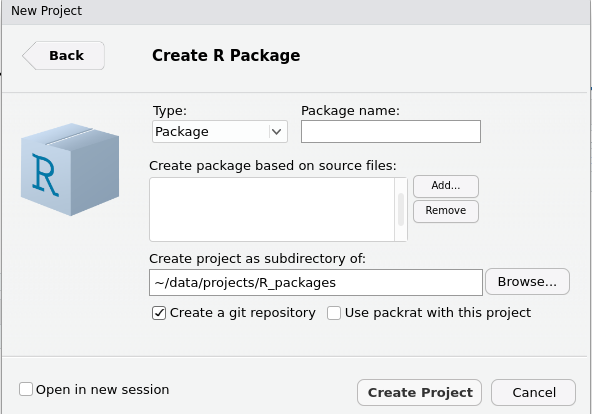
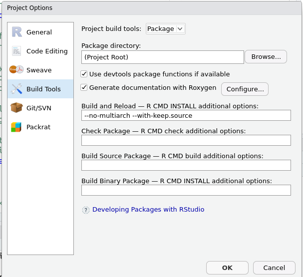
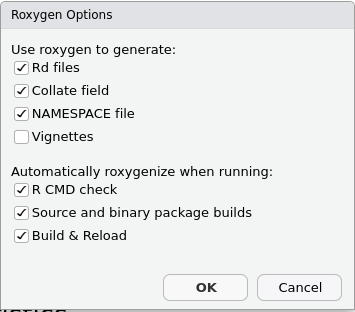
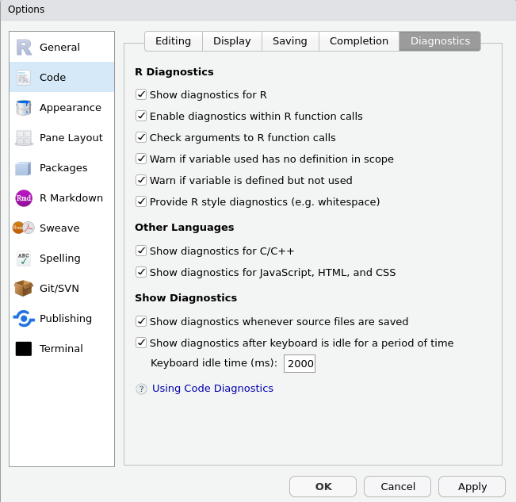
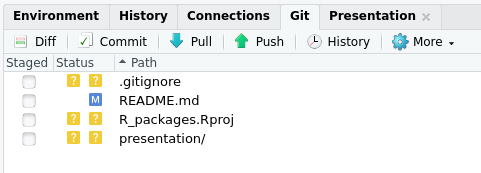

R packages
========================================================
author: Kevin Shook
date: Feb. 1, 2018
autosize: true

What is a package?
========================================================
- A compressed file
  - contains all of the files required to distribute R code
- Should work for anyone, on any type of computer

Why create a package?
========================================================
- The best way to distribute **R** code
- Makes your code reproducible
  - makes code reusable
  - improves code quality
  - self-documenting

Building a package
========================================================
- All components are text files
  - You could build them manually
- **DON'T!**
- Use the package **devtools**
  - makes it *much* easier
- Also, install packages **roxygen2, rmarkdown**
- Need LaTex installed to create manuals
- Also, make sure to have **git** installed on your system

Mandatory package components
========================================================
- 2 Files
  - DESCRIPTION
  - NAMESPACE
- directories
- 2 directories are mandatory
  - \R, code files
  - \man, documentation files
- may have other directories  
  
DESCRIPTION
========================================================
- Contains package description
- Has to have a specific format
- Has to indicate the packages required by your package

DESCRIPTION example
=======================================================

```r
Package: WISKIr  
Title: Acquires data from a WISKI web server  
Version: 2.1.5  
Date: 2017-12-01  
Author: Kevin Shook, Centre for Hydrology, University of Saskatchewan  
Maintainer: Kevin Shook <kevin.shook@usask.ca>  
Description:  Functions to acquire a) the set of time series for a station, b)
    the metadata for a specific times series, c) the values for a specified time
    series over a specified range of dates.  
Depends: R (>= 3.3) 
Imports: stringr (>= 1.0)  
License: GPL-3  
URL: www.usask.ca/hydrology  
```


NAMESPACE
========================================================
- Contains detailed information about each function
- Do NOT create or edit this file
  - **roxygen2** will automatically create and maintain it

R directory
========================================================
- Contains the R code
- Code must be written as functions
- Each function must be in a separate file
  - file name is same as function name
  - file extension must be **.R**

man directory
========================================================
- Contains the documentation files
- Creates the help system for the package
- Also creates the manual
- Each .R file has a .Rd file in **man**
  - Don't create these files manually

roxygen2
========================================================
- Used by **devtools**, installed by it
- Automatically creates the .Rd files
  - uses comments at the beginning of each .R file

Example
========================================================
- All lines begin with **#'**
- First line contains a 1 line description of the file
- Should not end with a period!
- Example:  
#' Calculates quantile values for a Quantile-Quantile plot  
- All other lines have a tag beginning with **@**

Tags
=========================================================

```r
#' @description - optional multi-line desciption  
#' @param - required for each parameter  
#' @return - required, specifies return value of function    
#' @author - optional, lists author  
#' @export - required if function is accessible outside your package
#' @examples - required, a working example
```

Formatting
=========================================================
- Documentation can include formatting codes
- \pkg{} - package
- \option{} - option
- \emph{} - emphasis
- \code{} - code

Example
=========================================================

```r
#' Calculates quantile values for a Quantile-Quantile plot   
#' @description The built-in \code{qqplot} function does not work with \pkg{ggplot2}. This just calls the qqplot function to caclulate the quantiles without plotting them.  
#' @param x Required. A numeric vector.  
#' @param y Required. A numeric vector.   
#' @return Returns a dataframe with the quantiles of x and y.  
#' @author Kevin Shook  
#' @export  
#' @examples  
#' quantiles <- qqplotValues(runif(20), runif(50)) 
```


Package function
==========================================================
- You should create a function that has the name of your package
- Example: WISKIr-package.R
- Contains information to create NAMESPACE


Example
==========================================================

```r
#' @title Contains functions to extract data from a Kisters WISKI web server.  
#' @docType package  
#' @name WISKIr-package 
#' @description ...    
#' @references ...  
#' @import stringr utils  
NULL  
```


Other folders
=========================================================
- You may see these folders in packages:
  - \data, data files used by the package
  - \vignettes, documentation written in Markdown
  - \inst, contains the file CITATION showing how to cite the package
  - \src, source code written in C, C++ or Fortran


Workflow
=========================================================
1. Create the packae
2. Add code
3. Build package
4. Check package
5. Create package file

1. Creating the package
=========================================================
- Create a new project in a new directory  
  - **File|New Project**
  - select **R Package**
  - then give your package a name and a location
- Make sure to use git!

***



New package
==========================================================
- R studio will create all of the files and directories
  - \R
  - \man
  - DESCRIPTION
  - NAMESPACE
- Also creates a sample file **hello.R** in \R
- Adds folders and files for git

Setting up roxygen
==========================================================
- Not enabled by default
- Set it up using **Tools|Project Options** 



***
- Configure to run automatically  


2. Adding R code
==========================================================
- Put your R code files in \R
- Must be functions
  - one function per file
- Add the roxygen skeleton to your code for each file
  - **Code|Insert Roxygen Skeleton**
- Fill in skeleton

Example
==========================================================


```r
#' Title  
#'  
#' @param par1   
#'  
#' @return  
#' @export  
#'  
#' @examples
testFunction <- function(par1 = "Hello" ) {
  cat(par1, "\n")
  }
```

3. Building package
===========================================================
- Use command **Build | Clean and Rebuild**
- Expect to get error messages!
- Fix until package builds
- If the package builds, it will be added to your list of packages

4. Checking the package
==========================================================
- Just because a package can build, doesn't mean that it is good!
- Use command **Build|Check**
  - does a detailed check of entire package
  - tries to run your examples
  - *very* picky
  - you will get many, many errors and warnings

Writing better code
===========================================================
- Turn on Code Diagnostics using **Tools|Global Options**  



5. Creating the package file
===========================================================
- 2 options:
  - **Build | Build Source Package** - contains source code (all languages)
  - **Build | Build Binary Package** - contains compiled Fortran, C, C++ code
- Reason is that Windows computers usually don't have compilers
- If just using **R** code, make it a source package
- If you are using Fortran, C, C++, create both types

Building the manual .pdf
===========================================================
- When the package is built, should also create the .pdf
- Must have LaTex installed
- For some reason, this doesn't work for me
  - have to do it manually
  - type in this command in the **R** console:

```r
system("R CMD Rd2pdf mypackage")
```

Copying an existing repository
===========================================================
- You can create a package by cloning an existing git repository
- **File|New Project** and select **Version Control**
- Works with GitHub - just enter the url
- Try this one: https://github.com/CentreForHydrology/WISKIr


***


Using git
===========================================================
- Every time you change your code, commit the changes to your git repository
- If you make a mistake, you can go back to an older version



